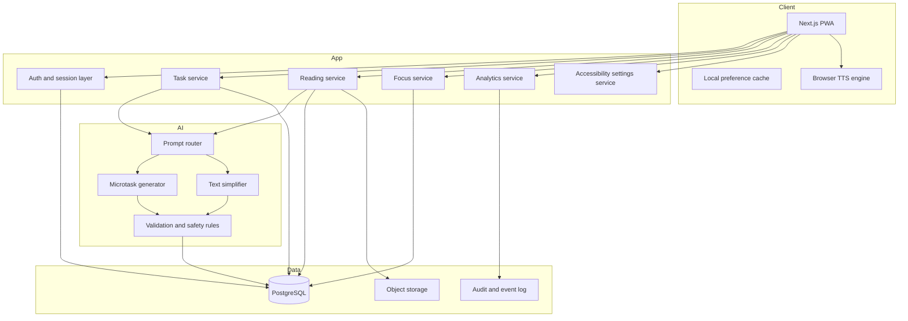
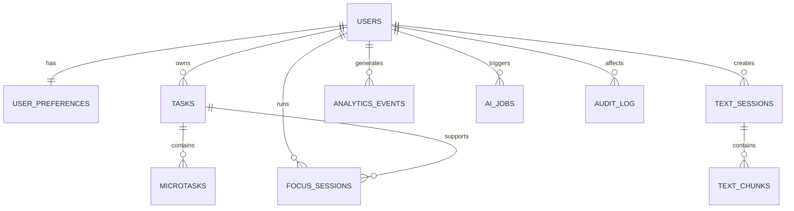
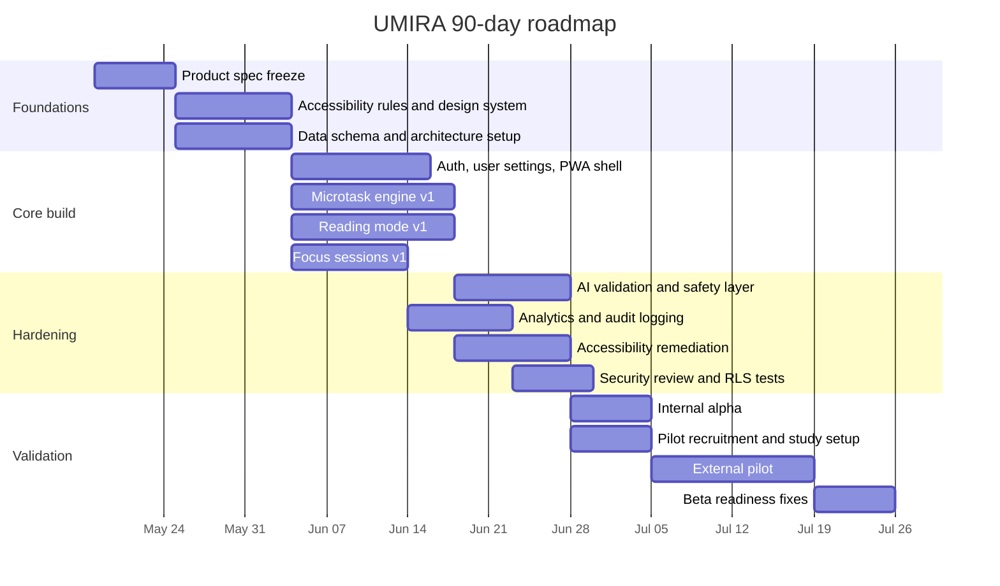

# UMIRA Practical Whitepaper

## Executive summary

The current UMIRA repository is a concept-stage artifact rather than a build-ready codebase. As of the repository state visible on GitHub, it contains a single public repository with one commit and a README labeled “Whitepaper v1.0 – Production Initiation Draft,” with no application code, issues, or supporting implementation files visible beyond that README. The README already frames UMIRA as “a neurodiversity-centered cognitive support platform for ADHD and dyslexia,” but many of its claims, architecture choices, and product promises still need to be operationalized, bounded, and de-risked before engineering begins. citeturn2view0turn0view0

The strongest next step is **not** to build UMIRA as a diagnostic or therapeutic medical product. It should be built first as a **general-wellness, assistive productivity, and accessible reading platform** for older teens and adults with ADHD and dyslexia traits or diagnoses, because the evidence base for digital supports is promising but still mixed, and current FDA guidance continues to distinguish low-risk wellness software from software that makes diagnosis or treatment claims. A recent systematic review of reviews found that digital interventions for ADHD show potential but that overall evidence quality remains inconclusive; meanwhile, FDA guidance in 2026 reaffirmed that low-risk general-wellness products are treated differently from clinical decision-support or disease-treatment software. citeturn22search0turn22search5turn24search5turn24search0

For an implementation-ready MVP, UMIRA should focus on five tightly-scoped modules: a **microtask engine**, **reading support mode**, **focus sessions**, a **cognitive preference profile**, and **first-party analytics**. This scope is justified by the convergence of evidence on ADHD-related executive-function and working-memory burdens, dyslexia-related decoding and verbal short-term-memory burdens, the benefits of read-aloud accommodations for reading-related disabilities, cognitive-load theory, and established accessibility frameworks such as WCAG 2.2, W3C COGA guidance, and CAST UDL 3.0. citeturn3search0turn3search1turn4search7turn16view0turn20search7turn17view9turn9search0turn15view2turn15view3turn25view2

The recommended MVP stack is **web-first, PWA-first**: Next.js with TypeScript for the application shell, Supabase/Postgres for auth, storage, and row-level-security-backed data isolation, Prisma for schema and migrations, and a **hybrid rules-plus-LLM architecture** rather than an LLM-only design. A Progressive Web App gives UMIRA a single codebase, installability, offline-friendly behavior, and broad reach, while leaving open a later migration path to Expo/React Native if app-store presence or deeper native hooks become essential. Official framework and platform documentation supports this recommendation: PWAs provide installability and cross-device reach from one codebase; Next.js App Router supports modern React server/client patterns; PostgreSQL supports row security at the database layer; Prisma provides typed queries and migration workflows; and Supabase wraps Postgres, auth, storage, and APIs into one platform. citeturn19search2turn19search10turn12search0turn12search1turn12search2turn12search6turn12search3turn12search7turn12search13

If UMIRA follows the plan in this paper, a serious first production candidate can be built in **90 days**, provided the team holds scope discipline. The goal of the first 90 days is not “full adaptive intelligence”; it is a **trustworthy, accessible, privacy-preserving assistant that demonstrably reduces task-start friction and reading friction** for a defined user segment. The product should be judged by measurable outcomes such as time-to-task-start reduction, increased focus-session completion, improved reading-support engagement, reduced perceived workload, and high usability scores from neurodivergent users. W3C’s cognitive-accessibility guidance specifically emphasizes involving people with cognitive and learning disabilities in design and testing, and NASA-TLX and SUS remain widely used tools for workload and usability measurement. citeturn15view3turn7search6turn7search7

## Repository assessment and product thesis

### What the repository currently establishes

The README establishes a credible direction, but it is still written as a concept paper rather than a delivery document. It identifies ADHD and dyslexia as the focus conditions, proposes microtasking, text simplification, read-aloud support, focus reinforcement, analytics, and adaptive modeling, and sketches a high-level React/application/AI/data architecture. It also includes a simplified schema and an outline for validation, security, and market positioning. Those ideas are directionally strong, but they are still incomplete for engineering because they do not yet define scope boundaries, data governance, exact user journeys, prompt/testing rules, accessibility acceptance criteria, or realistic claims for what an MVP can and cannot do. citeturn0view0turn1view0

The most important correction is conceptual: the README sometimes overstates certainty, especially around “dopamine-aligned reward loops,” “behavioral models,” and “end-to-end encryption.” Those phrases sound senior, but they are not implementation-ready without qualification. In the practical version of UMIRA, rewards should be framed as **short, optional feedback loops** rather than neurochemical claims; “behavioral adaptation” should start as transparent preference tuning rather than opaque personalization; and “end-to-end encryption” should not be promised in the MVP unless the product truly uses client-side encryption that even the server cannot access. The repository’s ambition is good; the production version must be more precise. citeturn1view0

### Problem statement

UMIRA should be built to solve a specific product problem:

> **People with ADHD and dyslexia often face recurring friction in task initiation, task sequencing, time estimation, dense-text reading, and sustained engagement. Existing tools usually solve only one layer of that friction at a time, forcing users to compose their own stack of task apps, timers, and reading supports.**

That problem is scientifically plausible and commercially real. ADHD is common in both youth and adults, with umbrella reviews/meta-analyses placing prevalence around 8.0% in children and adolescents and around 3.1% in adults. Developmental dyslexia is likewise common; a 2022 systematic review and meta-analysis estimated worldwide prevalence in primary-school children at 7.10%, and prevalence estimates vary depending on threshold and method. Dyslexia and ADHD also frequently co-occur, with review literature commonly reporting overlap in roughly the 25–40% range. citeturn4search8turn4search4turn4search21turn4search1turn18search8turn18search23

The practical implication is that UMIRA should not be pitched as a “cure” or “normalizer.” It should be pitched as a **cognitive friction-reduction layer** that reduces the amount of unsupported executive work and unsupported reading work users must do just to begin and maintain effort. That thesis is consistent with the repository’s core statement that systems should adapt to cognition rather than forcing cognition to adapt to systems. citeturn0view0

### Target users and exclusions

The most buildable user strategy is to start with a narrow segment and explicitly exclude use cases that will destabilize the MVP.

| Area | Recommendation |
|---|---|
| Primary MVP users | University students, older adolescents, remote workers, junior professionals, founders, and knowledge workers who self-identify with ADHD-like executive-friction patterns, dyslexia-like reading friction, or both |
| Secondary users | Accessibility-minded users without diagnosis who still benefit from chunking, read-aloud, simplified reading views, and structured focus sessions |
| Initial age boundary | Recommend **16+** for MVP to simplify consent, research participation, and data-governance complexity |
| Core contexts | Coursework, article reading, job tasks, admin tasks, project setup, inbox/document processing |
| Explicit exclusions | Diagnosis, treatment, crisis support, medication management, clinician-facing decision support, pediatric therapy workflows, school SIS/LMS integration in the first release |
| Regulatory boundary | Position UMIRA as **general wellness + assistive productivity + accessibility support**, not as a device that diagnoses or treats ADHD/dyslexia |

This boundary is supported by FDA’s 2026 general-wellness and clinical-decision-support guidance, which continues to distinguish low-risk software intended to support healthy lifestyle behavior from software intended for diagnosis, treatment, prevention, or clinical decision-making. citeturn24search5turn24search0

### Product vision and principles

UMIRA’s product vision should be:

> **A calm, adaptive, cognitively respectful workspace that helps neurodivergent users start, read, focus, finish, and reflect without shame, clutter, or hidden manipulation.**

That vision should be implemented through a small set of design principles.

**Choice over coercion.** CAST UDL 3.0 emphasizes multiple means of engagement and explicitly includes optimizing choice and autonomy; Self-Determination Theory likewise identifies autonomy as a core psychological need. UMIRA should therefore always allow users to edit generated steps, turn off gamification, choose reading modes, and override timing suggestions. citeturn25view0turn7search0turn7search16

**Reduce extraneous load first.** Cognitive Load Theory holds that performance declines when avoidable load consumes limited working-memory capacity. In practice, this means simpler layouts, fewer simultaneous choices, one primary action per screen, and progressive disclosure. citeturn9search0turn9search15

**Preserve user agency and meaning.** Simplification should never erase the original text or hide that an AI transform occurred. NIST’s AI RMF places weight on validity, transparency, explainability, privacy enhancement, and harm management. UMIRA should show the original and the simplified version side by side whenever meaning matters. citeturn14view0turn14view1

**Accessibility is broader than WCAG alone.** WCAG 2.2 is the minimum baseline, but W3C explicitly notes that WCAG does not address all cognitive-accessibility needs and recommends supplemental cognitive guidance. UMIRA should therefore adopt WCAG 2.2 AA **plus** W3C COGA “Content Usable” patterns and UDL-informed interaction design. citeturn15view2turn15view3turn15view4

**Optional motivation, not addictive engagement.** Gamification research trends positive but mixed, and Self-Determination Theory suggests that competence-supporting, autonomy-supporting feedback is stronger than pressure-heavy or manipulative reward design. UMIRA should avoid leaderboards, shame-based streaks, and variable-ratio reward mechanics. citeturn8search4turn8search6turn7search0turn7search16

## Scientific and design foundation

### Why UMIRA is scientifically plausible

A practical whitepaper must connect diagnosis-adjacent science to concrete interaction design. The table below translates the strongest evidence into implementation implications.

| Evidence area | High-confidence finding | Practical implication for UMIRA |
|---|---|---|
| ADHD executive function | Classical and later ADHD literature links ADHD to inhibitory-control, self-regulation, and executive-function difficulties; working-memory impairments are strongly replicated in meta-analysis. | Offload task initiation, sequencing, and holding steps in mind. Show the next action only. Use pre-commitment defaults and low-friction start prompts. |
| ADHD time processing | Recent reviews/meta-analyses support measurable time-perception differences in ADHD across the lifespan. | Use visible countdowns, pre-set session lengths, buffer-time suggestions, and “how long this usually takes” estimates. |
| Dyslexia reading profile | Contemporary dyslexia definitions emphasize word-reading/spelling difficulty, with phonological and morphological processing difficulties common though not universal; dyslexia also affects reading fluency and may have downstream effects on comprehension and academic function. | Do not assume one visual style solves dyslexia. Offer customizable reading support: text spacing, line focus, syllable/phrase aids, read-aloud, and semantic chunking. |
| Dyslexia and working memory | Research supports verbal short-term-memory and verbal working-memory burdens in dyslexia. | Avoid dense paragraphs, long multistep textual instructions, and memory-heavy interfaces. Use chunked instructions and persistent cues. |
| Read-aloud accommodation | Meta-analytic evidence shows oral presentation/read-aloud tools support higher reading-comprehension performance for students with reading-related disabilities, with average weighted effect sizes around 0.35 overall and 0.36 for K–12 samples. | Read-aloud is not a “nice-to-have”; it is core MVP functionality. Include highlighting, speed control, and pause/resume. |
| Cognitive load | Sweller’s work and later instructional-design literature show that avoidable load reduces learning/performance. | Strip visual clutter, reduce competing affordances, and avoid forcing users to translate dense content into action by themselves. |
| Motivation | SDT emphasizes autonomy, competence, and relatedness; gamification literature shows benefits are context dependent and not uniformly positive. | Use optional progress reinforcement, immediate completion feedback, and self-referenced progress rather than social comparison. |
| UDL and cognitive accessibility | CAST UDL 3.0 emphasizes engagement, representation, and action/expression; W3C cognitive-accessibility guidance requires design/testing for memory, attention, language, and comprehension barriers. | Support multiple ways to receive, process, and act on information; include neurodivergent users in testing and treat accessibility as a product requirement, not a QA afterthought. |

The evidence in this table is drawn from Barkley (1997), Martinussen et al. (2005), recent ADHD time-perception reviews/meta-analyses, the International Dyslexia Association’s 2025 definition, dyslexia reviews, working-memory studies, read-aloud meta-analysis, cognitive-load theory, Self-Determination Theory, CAST UDL 3.0, and W3C accessibility guidance. citeturn3search0turn3search1turn4search7turn4search15turn16view0turn3search2turn20search7turn20search15turn20search21turn17view9turn9search0turn7search0turn8search4turn15view3turn25view2

### What this means for the product

UMIRA should be built around **offloading**, **customizable representation**, and **short feedback loops**, not around generic “AI productivity.” ADHD evidence supports reducing initiation and sequencing burden; dyslexia evidence supports multimodal reading access and low-memory interfaces; W3C and CAST support multiple means of engagement, representation, and action. citeturn3search0turn3search1turn16view0turn17view9turn25view0turn25view2turn15view4

Just as important, the evidence does **not** justify aggressive claims such as “UMIRA improves ADHD symptoms” or “UMIRA treats dyslexia” at MVP stage. Digital-intervention evidence in ADHD is encouraging but still mixed and often low-quality or heterogeneous, which means UMIRA should start as a **support platform** and earn stronger claims only after formal evaluation. citeturn22search0turn22search4turn22search5

## MVP product design

### Precise MVP scope

The MVP should answer a narrow question:

> **Can UMIRA reliably reduce task-start friction and reading friction for neurodivergent users in everyday work/study contexts, while meeting high accessibility and privacy standards?**

That leads to the following MVP scope.

| In scope for the first release | Out of scope for the first release |
|---|---|
| Manual task entry and AI-assisted microtasking | Full calendar/task ecosystem replacement |
| Paste-text reading support | OCR-heavy document ingestion pipeline |
| Read-aloud with synchronized highlighting | Advanced voice cloning or premium narration studio |
| 10–25 minute focus sessions with optional cues | Multiplayer study rooms or social accountability network |
| User preference profile and lightweight adaptation | Opaque behavioral scoring or diagnosis inference |
| First-party analytics dashboard for the user | Institution-wide admin analytics and school reporting |
| Export/delete controls and basic auditability | Deep enterprise compliance suite |

### Core user journeys

**Journey one: the overwhelmed student.** A user pastes a reading assignment, switches to “simplified reading + read aloud,” highlights key ideas, and converts the resulting action items into a short task list. The point is to bridge reading into action with minimal working-memory cost. This is directly aligned with dyslexia evidence, read-aloud evidence, and UDL representation principles. citeturn16view0turn17view9turn25view2

**Journey two: the stalled knowledge worker.** A user enters “prepare product update email and slides,” receives a 6-step plan, starts a 15-minute focus sprint on the first step, and receives a completion reflection prompt at the end. This journey mainly targets ADHD task-initiation and sequencing burden. citeturn3search0turn3search1turn4search7

**Journey three: the fatigued founder or freelancer.** A user with fluctuating attention opens UMIRA on mobile or desktop, sees “your next best step,” reads a simplified project brief, runs a short session, and exits with one completed microtask instead of managing a whole project board. This is where PWA installability and a low-friction interface matter most. citeturn19search2turn19search10

### Detailed module specifications

| Module | Functional specification | AI involvement | Acceptance criteria |
|---|---|---|---|
| Microtask engine | Accept a goal or task text; return 3–12 atomic steps with verbs, dependencies, and estimated effort; allow edit, reorder, delete, merge, and mark-next-step | Hybrid: template classifier + LLM generation + rule validator | 95% of generated task lists pass validation rules; user can reach “start first step” in under 20 seconds from submission; every generated step must have one action verb and be under 120 characters |
| Reading support | Accept pasted text; preserve original; generate simplified version; support line focus, spacing, font size, highlighting, glossary, and read-aloud | Hybrid: sentence segmentation/ranking + LLM simplification constrained by length and meaning-preservation checks | Original text always visible; read-aloud can start within 1 click; highlighting stays synchronized; user can switch reading mode without losing place |
| Focus sessions | Start 10/15/20/25 minute sessions; optional pre-focus ritual; pause/resume; break suggestion; completion check-in | Mostly rules-based; optional AI reflection summary | Session can run offline once loaded; completion recorded accurately; no punitive streak loss; user can disable nudges |
| Cognitive preference profile | Store preferences for text density, font/spacing, session length, cue intensity, reward style, and reading aids; no diagnosis inference | Rules-based first; adaptation only with explicit consent | Onboarding completed in under 3 minutes; every preference is editable later; defaults are conservative and accessible |
| Analytics | Show personal trends: starts, completions, favored session length, reading mode usage, estimated vs actual time | Rules-based aggregation only in MVP | User sees value without exposing raw sensitive data; all analytics events are first-party; export/delete works from settings |

These module choices are consistent with the scientific design logic above and with the current repository’s conceptual modules, but they remove overreach and convert the idea into testable product units. citeturn1view0turn3search0turn16view0turn17view9turn25view2

### Prioritized feature backlog

| Priority | Feature | Impact | Effort | Why it belongs here |
|---|---|---:|---:|---|
| Must | Task input + microtask generation | High | Medium | Core differentiator for executive-friction relief |
| Must | PWA shell + sign-in + local draft saving | High | Medium | Reach, installability, and session continuity |
| Must | Reading mode with original/simplified toggle | High | Medium | Core dyslexia and cognitive-load value |
| Must | Browser-based read-aloud + sync highlight | High | Medium | Evidence-backed accessibility support |
| Must | Focus timer with completion logging | High | Low | Strong immediate behavioral value |
| Must | Preference profile + settings | High | Low | Enables accessibility personalization |
| Must | First-party events + basic analytics | Medium | Medium | Required for adaptation and validation |
| Should | Time-estimation assistant | Medium | Medium | Useful for ADHD time-perception support |
| Should | AI reflection summary after session | Medium | Medium | Helpful but non-core |
| Should | Simple glossary / key-term explainer | Medium | Medium | Supports comprehension |
| Later | File uploads + OCR | Medium | High | Valuable, but complexity-heavy |
| Later | Integrations with LMS/calendar/email | Medium | High | Strong retention feature, not first-release necessity |
| Later | Collaborative study / coach mode | Low | High | Requires moderation, privacy, and trust layers |

### Sample wireframes

These wireframes are intentionally low fidelity; they are intended to communicate interaction structure, not final visual design.

```text
HOME
┌─────────────────────────────────────────────┐
│ Good afternoon, Alisha                      │
│ Next best step: Draft intro paragraph       │
│ [Start 15 min focus]  [Read source text]    │
├─────────────────────────────────────────────┤
│ Today                                       │
│ • Read article summary      60%             │
│ • Draft whitepaper section  Next            │
│ • Send follow-up email      Later           │
├─────────────────────────────────────────────┤
│ Quick add task...                           │
└─────────────────────────────────────────────┘
```

```text
READING MODE
┌─────────────────────────────────────────────┐
│ Original | Simplified | Side-by-side        │
│ Font A+  Spacing  Line focus  Read aloud ▶  │
├─────────────────────────────────────────────┤
│ [Highlighted sentence is read aloud here]   │
│ Dense text is split into visual chunks.     │
│ Key ideas appear in a right-side summary.   │
├───────────────────────┬─────────────────────┤
│ Original text         │ Simplified version  │
│ preserved             │ shorter sentences   │
└───────────────────────┴─────────────────────┘
```

```text
MICROTASK VIEW
┌─────────────────────────────────────────────┐
│ Goal: Prepare weekly update                  │
│ Estimated mode: 3 short steps                │
├─────────────────────────────────────────────┤
│ 1. Open last week’s notes      [Start now]   │
│ 2. Extract three main wins                   │
│ 3. Draft update email                        │
│ + Add step   Reorder   Merge   Simplify more │
└─────────────────────────────────────────────┘
```

## Architecture, data, and AI

### Platform and stack choices

The build recommendation is **web/PWA first**, with native mobile deferred unless traction or hardware-level requirements justify it.

| Option | Strengths | Trade-offs | Recommendation |
|---|---|---|---|
| Web app + PWA | Single codebase, installable, broad reach, easier accessibility testing, fastest route to market | Native push/background behavior can vary by platform | **Best MVP choice** |
| Expo / React Native | Better app-store distribution and deeper native features | Higher build/test/release overhead | Use in Phase II if push, sensors, or app-store growth become decisive |
| Desktop wrapper | Strong for deep-work desktop use | Added packaging/support complexity | Not needed for MVP |

This recommendation follows official guidance from web.dev/MDN on PWAs and from Expo/React Native docs on cross-platform native development. citeturn19search2turn19search10turn19search15turn19search1turn19search11turn19search5

The recommended implementation stack is shown below.

| Layer | Recommendation | Justification |
|---|---|---|
| App framework | Next.js + TypeScript | Mature React stack; App Router supports Server Components, Suspense, and server functions; good fit for PWA shell and content-heavy flows |
| Database | PostgreSQL | Strong relational fit for users, tasks, sessions, preferences, and event logs |
| Backend platform | Supabase | Postgres, auth, storage, APIs, and RLS-backed access control in one managed platform |
| ORM / schema | Prisma | Type-safe queries and migration history reduce schema drift |
| TTS | Browser Web Speech API first; provider abstraction for cloud voices later | Fast MVP path, no mandatory backend dependency for baseline read-aloud |
| AI orchestration | Server-side hybrid pipeline | Easier safety filtering, logging, throttling, and provider abstraction |

The framework/platform choices above are grounded in official docs from Next.js, PostgreSQL, Prisma, Supabase, and MDN’s Web Speech API documentation. citeturn12search0turn12search8turn12search1turn12search2turn12search6turn12search3turn12search7turn12search13turn21search0turn21search1

### Reference architecture diagram



### Data model

The data model should be intentionally boring. UMIRA does not need polymorphic AI objects everywhere; it needs clean, auditable relational data.

| Table | Core fields |
|---|---|
| users | id, email, created_at, locale, timezone, consent_version, marketing_opt_in |
| user_preferences | user_id, text_density, line_focus, font_scale, spacing_mode, session_length_default, cue_intensity, reward_style, simplify_level |
| tasks | id, user_id, title, source_text, status, priority, due_at, created_at, archived_at |
| microtasks | id, task_id, label, position, estimated_minutes, status, generated_by, edited_by_user, created_at |
| text_sessions | id, user_id, source_type, original_text, simplified_text, readability_target, tts_enabled, created_at |
| text_chunks | id, text_session_id, chunk_index, original_chunk, simplified_chunk, key_terms_json |
| focus_sessions | id, user_id, task_id, planned_minutes, actual_minutes, status, distraction_events, reflection_text, created_at |
| analytics_events | id, user_id, event_name, event_props_json, created_at |
| ai_jobs | id, user_id, job_type, input_hash, output_hash, validator_status, model_class, created_at |
| audit_log | id, user_id, action, entity_type, entity_id, metadata_json, created_at |

### ER diagram



### Privacy-by-design rules

NIST’s Privacy Framework and AI RMF both emphasize risk management, privacy enhancement, and accountability. For UMIRA, that becomes a concrete product policy rather than a generic compliance slogan. citeturn14view2turn14view1

**Minimize raw-content retention.** By default, store only what is necessary for continuity. Pasted text used only for one-off simplification should be deletable immediately after the session unless the user explicitly saves it.

**Separate identity from behavior where possible.** Use internal user IDs for events and analytics; keep profile preferences and event histories decoupled from marketing systems.

**Treat cognitive-profile data as high-sensitivity product data.** Whether or not it is legally classified as health data in every jurisdiction, it should be handled as if a breach would be materially harmful.

**Prefer first-party analytics.** For MVP, use your own event tables rather than broad third-party behavioral tracking scripts.

**Implement hard deletion and export from day one.** The README promises deletion/export. In the production plan, that must be a tested system feature, not a support ticket workflow. citeturn1view0turn14view2

### AI design

The right AI design for UMIRA is **assistive, constrained, and inspectable**.

#### Prompt template for microtask generation

```text
SYSTEM:
You convert a user goal into a short, low-friction action plan for a neurodivergent user.
Rules:
- Output 3 to 12 steps.
- Each step must begin with a concrete verb.
- Keep each step under 120 characters.
- Prefer one action per step.
- Avoid jargon, ambiguity, and nested options.
- Do not infer diagnosis or mental state.
- If the goal is unsafe or medical, refuse and explain briefly.

USER:
Goal: {{goal_text}}
Context: {{context_optional}}
Preferred session length: {{session_length}}
Need extra simplification: {{yes_no}}
```

#### Prompt template for text simplification

```text
SYSTEM:
You rewrite text to reduce cognitive load while preserving meaning.
Rules:
- Preserve all key facts.
- Shorten sentences.
- Use plain language.
- Keep headings and structure where possible.
- Return both: concise summary and chunked simplified text.
- If the source is instructional, preserve sequence.
- Do not add facts not present in source text.

USER:
Text: {{source_text}}
Reading preference: {{light|medium|high_simplification}}
Glossary mode: {{on|off}}
```

#### Validation layer

Every LLM output should pass deterministic validation before reaching the user:

| Validator | Rule |
|---|---|
| Length validator | No microtask exceeds 120 characters by default |
| Structure validator | Each microtask contains exactly one leading action verb |
| Safety validator | Reject diagnosis, treatment, crisis advice, or manipulative language |
| Grounding validator | Simplified text cannot introduce named entities or claims missing from source |
| Accessibility validator | No dense paragraph exceeds configurable line/length thresholds in simplified mode |
| Diff validator | If source and simplified versions diverge materially, show warning and preserve original |

#### Safety limits

NIST’s AI RMF identifies trustworthy AI characteristics including validity, safety, security, accountability, explainability, privacy enhancement, and harmful-bias management. UMIRA should operationalize those characteristics through product boundaries rather than marketing copy. citeturn14view0turn14view1

So the MVP should enforce the following limits:

- No ADHD or dyslexia diagnosis suggestions  
- No medication advice  
- No crisis counseling or suicide/self-harm handling beyond safe redirection  
- No hidden personalization from vulnerable-behavior inference  
- No automatic profile updates without user-visible explanation  
- No “black box” simplification without access to the source text  

## Accessibility, security, and responsible use

### UX and accessibility specification

UMIRA should target **WCAG 2.2 AA** as baseline, then add **COGA/Content Usable** rules for cognitive accessibility and **UDL 3.0** principles for representation, engagement, and action. WCAG 2.2 explicitly covers cognitive, language, learning, and neurological disabilities but also acknowledges that not all user needs are met there; W3C’s “Content Usable” guidance and CAST UDL fill important gaps. citeturn15view2turn15view3turn15view4turn25view2

| Spec area | Requirement |
|---|---|
| Focus visibility | Meet WCAG 2.2 “Focus Not Obscured” requirements; sticky controls must not cover active elements |
| Hit targets | Meet WCAG 2.2 “Target Size Minimum” for touch interactions |
| Authentication | Avoid puzzle-heavy or memory-heavy authentication paths; support accessible authentication patterns |
| Reading display | Support font scaling, spacing controls, line focus, theme options, and reduced-motion mode |
| Copy style | Use plain language; short sentences; concrete verbs; logical chronology for process instructions |
| Navigation | One dominant CTA per screen; stable menu positions; predictable back behavior |
| Error handling | Provide corrective guidance in-line; avoid destructive ambiguity; never rely on color alone |
| Cognitive support | Use chunking, progressive disclosure, state persistence, and “resume where I left off” patterns |
| Testing | Combine automated accessibility tests with moderated usability sessions involving people with cognitive and learning disabilities |

This specification is directly grounded in WCAG 2.2, W3C COGA guidance, NIH/plain-language resources, and CAST UDL’s emphasis on customizable representation and strategic action support. citeturn15view2turn15view3turn15view4turn23search1turn23search12turn25view2

A crucial W3C point should become a non-negotiable operating rule for UMIRA: **automated accessibility testing is not enough for cognitive accessibility**. W3C explicitly says teams should not rely solely on automation and should involve people with cognitive and learning disabilities in usability research. citeturn15view3

### Security baseline

UMIRA should adopt **OWASP ASVS** as its secure-development checklist and treat **OWASP Top 10** categories as engineering review categories, not just security-team concerns. OWASP’s ASVS is specifically intended as a basis for testing application technical security controls, and the OWASP Top 10 remains the broad awareness document for critical web-application risks. citeturn13search0turn13search1

Recommended MVP security controls are below.

| Control area | MVP control |
|---|---|
| Access control | Enforce per-user row isolation via PostgreSQL RLS; verify ownership on every object fetch/write |
| Secrets | Keep model/API keys server-side only; never expose provider secrets in client bundles |
| Data in transit | TLS everywhere |
| Data at rest | Encrypt managed storage; restrict privileged roles |
| Auditability | Write delete/export/profile changes to immutable audit_log |
| Input handling | Validate and sanitize pasted text, task text, and AI outputs before rendering |
| Dependency hygiene | CI dependency scanning and weekly upgrade policy |
| Logging | Capture auth failures, abnormal exports, and AI safety violations without logging raw sensitive text unnecessarily |

PostgreSQL’s own docs confirm that row-security policies are table-scoped policies that restrict what rows a user can access, and Supabase documents RLS as the recommended mechanism for granular authorization on application data. citeturn12search1turn12search13turn12search11

### Responsible-use and regulatory posture

This section should appear on the website and in the product:

- UMIRA is an assistive productivity and reading-support tool.  
- UMIRA is not a diagnostic tool and does not replace professional evaluation or treatment.  
- UMIRA does not provide clinical decision support to clinicians or medical advice to users.  
- If future versions introduce treatment or diagnostic claims, the regulatory strategy must be revisited before release.  

That is the safest and most practical posture in light of FDA’s current general-wellness and CDS guidance. citeturn24search5turn24search0

## Validation, roadmap, and commercial model

### Validation and research plan

Because evidence for digital ADHD interventions is not yet strong enough to justify sweeping claims, UMIRA should adopt a two-stage evidence plan from the start. citeturn22search0turn22search4turn22search5

#### Pilot study

**Purpose:** establish usability, accessibility, adherence, and signal of benefit.  
**Design:** 4-week mixed-method pilot, n=20–30, split across ADHD-only, dyslexia-only, and co-occurring users.  
**Primary metrics:**  
- SUS mean score  
- NASA-TLX overall and mental-demand subscore  
- Task-start latency  
- Microtask completion rate  
- Focus-session completion rate  
- Reading-support session duration  
- Qualitative reports of friction reduction and failure modes  

**Pilot success thresholds:**  
- SUS mean ≥ 75  
- NASA-TLX total workload reduced by at least 15% from baseline task condition  
- Median task-start latency reduced by at least 20%  
- At least 70% weekly retention at week 4  
- Zero P1 accessibility defects remaining at pilot close  

SUS and NASA-TLX are well-established usability/workload tools, and W3C guidance strongly supports involving people with cognitive and learning disabilities directly in usability testing. citeturn7search6turn7search7turn15view3

#### Controlled study

**Purpose:** test whether UMIRA improves real task execution and reading support versus a comparison condition.  
**Recommended design:** randomized crossover or waitlist-controlled design, n=60–100.  
**Comparison condition:** user’s existing tool stack or a minimal comparison app with checklist + timer only.  
**Primary outcomes:**  
- Time to first concrete action  
- Task completion odds within fixed window  
- Reading-comprehension quiz score after supported reading  
- NASA-TLX change  
- Adherence (sessions/week)  

**Statistical plan:**  
- Mixed-effects regression for repeated measures  
- Report p-values, 95% CIs, Cohen’s d for continuous outcomes, and odds ratios for completion outcomes  
- Pre-register primary outcomes and handling of missing data  
- Analyze subgroup effects for ADHD-only, dyslexia-only, and co-occurring participants  

This is practical, publishable, and proportionate. It also supports later fundraising, partnerships, and ethics review.

### Ninety-day roadmap

The roadmap below assumes a start on **May 18, 2026** and ends on **August 13, 2026**.



### Milestones, deliverables, and acceptance criteria

| Milestone | Deliverable | Acceptance criteria |
|---|---|---|
| Spec freeze | Final PRD, user flows, schema, accessibility checklist | All MVP screens and events defined; out-of-scope list approved |
| Alpha build | Working auth, tasks, microtasks, reading mode, focus timer | End-to-end flow works for one user with no manual DB edits |
| Safety complete | Validation rules, refusal behaviors, logging | Unsafe prompts blocked; source-preservation checks enforced |
| Accessibility complete | WCAG 2.2 AA audit + cognitive review fixes | No blocker defects for keyboard, focus visibility, target size, accessible auth |
| Pilot ready | Instrumentation, consent flow, support playbook | SUS/NASA-TLX and event metrics wired; export/delete verified |
| Beta ready | Stable hosted build + pilot report | Crash-free sessions >99%; pilot thresholds met or gaps explicitly documented |

### Immediate execution sequence

If you start next, the correct order is:

1. Freeze problem statement, target user, exclusions, and MVP scope.  
2. Build the schema and RLS policies before adding AI.  
3. Implement task flow and reading flow without “smart” adaptation first.  
4. Add validation-constrained AI.  
5. Run accessibility and pilot testing before adding integrations or more AI features.  

This order is the fastest way to ship something real without creating rework.

### Market positioning

The market gap is real, but it is narrower than the README suggests. UMIRA will compete indirectly with task apps, reading-accessibility tools, and neurodivergent helper tools.

| Product | What it already does well | Where UMIRA can differentiate |
|---|---|---|
| Todoist | Strong task capture, sub-tasks, priorities, natural-language task management | Add neurodiversity-specific microtasking logic, cognitive-profile adaptation, and integrated reading support |
| Microsoft Immersive Reader | Distraction-free reading, read aloud, text customization, line focus, translation, syllables | Add action conversion, task scaffolding, preference memory, and personal analytics |
| Speechify | High-quality text-to-speech across documents and web content | Add source simplification, task conversion, session support, and deep accessibility settings |
| Goblin Tools | Excellent lightweight task breakdown and one-task-at-a-time helper tools | Add longitudinal profile, reading support, privacy controls, and evidence-driven UX |

These comparisons are based on the products’ official feature descriptions. citeturn11search0turn11search8turn11search1turn11search5turn11search13turn11search9turn11search2turn11search6turn11search3turn11search11

### Business model

The best business model is a **three-lane strategy**:

| Lane | Offer | Rationale |
|---|---|---|
| Consumer free | Basic task breakdown, 1–2 reading modes, simple timer, local preferences | Low-friction acquisition and habit formation |
| Consumer premium | Unlimited reading sessions, advanced simplification, richer insights, multi-device sync, export history | Direct revenue with clear value expansion |
| Institutional | Student-support offices, disability/accessibility services, coaching/learning centers | Strong fit if UMIRA proves accessibility value and privacy discipline |

Do **not** begin with enterprise-heavy procurement or “digital therapeutic” positioning. Consumer-plus-academic support services is the more realistic first wedge.

### Risk register

| Risk | Severity | Likelihood | Mitigation |
|---|---:|---:|---|
| LLM simplification distorts meaning | High | Medium | Preserve original text, run diff/meaning validators, allow user report |
| Product drifts into medical claims | High | Medium | Strict copy review; wellness framing; legal/regulatory check before claim expansion |
| Accessibility fails real users despite automated passes | High | Medium | Conduct cognitively diverse usability tests early and iteratively |
| Data sensitivity undermines trust | High | Medium | First-party analytics, export/delete, minimized retention, transparent settings |
| Scope explosion | High | High | Freeze MVP; no integrations/OCR/social layer in first 90 days |
| Personalization feels creepy or opaque | Medium | Medium | Start with explicit preferences, not inferred diagnoses or hidden scoring |
| Retention is weak | Medium | Medium | Optimize “next best step” and reading-to-action loop before adding more features |
| Browser TTS inconsistency across devices | Medium | High | Use provider abstraction and offer cloud TTS fallback in premium/later phase |

### Open questions and limitations

The biggest unresolved questions are strategic rather than technical. They are: whether UMIRA’s first strong beachhead is student accessibility support or consumer productivity; whether the product will remain 16+ through its first year; how deep offline support should go in the PWA; and whether multilingual support is a phase-one or phase-two requirement.

There is also an evidence limitation worth stating plainly: much of the dyslexia and ADHD literature is strongest around cognitive characteristics and accommodation effects, while digital-product outcomes for broad consumer tools remain more heterogeneous. That is why this whitepaper recommends **measured product claims, strong instrumentation, and real-world pilot data before stronger efficacy claims**. citeturn22search0turn22search4turn22search5

## References

Barkley, R.A. (1997) ‘Behavioral inhibition, sustained attention, and executive functions’, *Psychological Bulletin*. citeturn3search0

CAST (2024) *CAST Universal Design for Learning Guidelines version 3.0*. citeturn15view0turn15view1turn25view0turn25view2

FDA (2026) *General Wellness: Policy for Low Risk Devices* and *Clinical Decision Support Software* guidance. citeturn24search5turn24search0

GitHub (2026) *seamoonpandey/UMIRA README.md*, repository state reviewed May 2026. citeturn2view0turn0view0

Hamari, J., Koivisto, J. and Sarsa, H. (2014) ‘Does gamification work? A literature review of empirical studies on gamification’, HICSS. citeturn8search4turn8search9

International Dyslexia Association (2025) *Definition of Dyslexia* and Dyslexia basics resources. citeturn16view0turn15view5

Martinussen, R., Hayden, J., Hogg-Johnson, S. and Tannock, R. (2005) ‘A meta-analysis of working memory impairments in children with ADHD’, *Journal of the American Academy of Child & Adolescent Psychiatry*. citeturn3search1

Metcalfe, K.B. et al. (2024) ‘A systematic review and meta-analysis’ on time perception in ADHD. citeturn4search7

NIST (2020/2026) *Privacy Framework* resources. citeturn14view2

NIST (2023) *Artificial Intelligence Risk Management Framework 1.0*. citeturn14view0turn14view1

NIH (2025) *Plain Language at NIH*. citeturn23search1

OWASP (2025) *Application Security Verification Standard* and *OWASP Top Ten*. citeturn13search0turn13search1

Peterson, R.L. and Pennington, B.F. (2012) ‘Developmental dyslexia’, *The Lancet*. citeturn3search2turn3search26

Ryan, R.M. and Deci, E.L. (2000) ‘Self-Determination Theory and the facilitation of intrinsic motivation, social development, and well-being’, *American Psychologist*. citeturn7search0turn7search16

Sweller, J. (1988) ‘Cognitive load during problem solving: Effects on learning’, *Cognitive Science*. citeturn9search0turn9search2

W3C (2023/2024) *Web Content Accessibility Guidelines 2.2*. citeturn15view2

W3C (2021) *Making Content Usable for People with Cognitive and Learning Disabilities*. citeturn15view3

W3C WAI (2026) *Cognitive Accessibility at W3C*. citeturn15view4

Wagner, R.K. et al. (2020) ‘The prevalence of dyslexia: A new approach to its estimation’. citeturn4search1

Wood, S.G., Moxley, J.H., Tighe, E.L. and Wagner, R.K. (2018) ‘Does use of text-to-speech and related read-aloud tools improve reading comprehension for students with reading disabilities? A meta-analysis’, *Journal of Learning Disabilities*. citeturn17view9

Yang, L. et al. (2022) ‘Prevalence of developmental dyslexia in primary school children: a systematic review and meta-analysis’, *Brain Sciences*. citeturn4search21

Ayano, G. et al. (2023/2024) umbrella reviews on ADHD prevalence in adults and children/adolescents. citeturn4search0turn4search4turn4search8